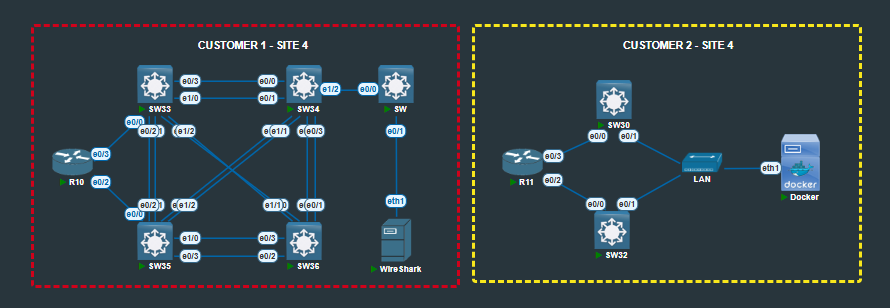

# Layer 2 Technologies - Advanced Switching Configuration

## Overview
Implemented comprehensive Layer 2 switching technologies across two customer sites, focusing on high availability, VLAN management, spanning tree optimization, and network monitoring. Configured advanced features including FHRP, VTP v3, MST, port channels, and RSPAN.



## Requirements Completed

### Customer 2 Site 4 - High Availability Configuration
1. Cisco proprietary FHRP (HSRP) with gateway 10.1.24.1/24
2. SW30 configured as primary HSRP router
3. Interface tracking for upstream connectivity detection (Layer 2/3)
4. HSRP preemption for automatic failback to SW30
5. EIGRP ASN 60 between R11 and switches
6. Default route distribution from R11 to switches

### Customer 1 Site 4 - Advanced Switching Features
7. VLAN 10/20 IP addressing without local VLAN configuration
8. Trunk port configuration between all switches
9. VTP version 3 implementation (domain: CISCO, SW36 as primary server)
10. VLAN 10 and 20 creation and assignment
11. Multiple Spanning Tree (MST) configuration with SW38 as root
12. Spanning Tree root bridge optimization (SW36 primary, SW35 backup)
13. Cisco proprietary aggregation (PAgP) between SW33-SW36
14. IEEE 802.3ad aggregation (LACP) between SW35-SW34
15. Port-channel path optimization for root bridge access
16. RSPAN monitoring for VLAN 10 traffic analysis

## Configuration Examples

### Customer 2 Site 4 - HSRP Configuration

#### HSRP Primary (SW30)
```cisco
! HSRP Configuration
interface vlan 24
 ip address 10.1.24.30 255.255.255.0
 standby version 2
 standby 1 ip 10.1.24.1
 standby 1 priority 110
 standby 1 preempt
 standby 1 track ethernet0/1 line-protocol
 standby 1 track ethernet0/2 ip routing
```

#### HSRP Secondary (SW32)
```cisco
interface vlan 24
 ip address 10.1.24.32 255.255.255.0
 standby version 2
 standby 1 ip 10.1.24.1
 standby 1 priority 100
 standby 1 preempt
```

#### EIGRP Configuration
```cisco
! R11 - Default Route Distribution
router eigrp 60
 network 10.1.24.0 0.0.0.255
 redistribute static

ip route 0.0.0.0 0.0.0.0 [upstream-next-hop]

! SW30/SW32 - EIGRP Client
router eigrp 60
 network 10.1.24.0 0.0.0.255
 passive-interface default
 no passive-interface vlan24
```

### Customer 1 Site 4 - Advanced Layer 2 Features

#### VTP Version 3 Configuration
```cisco
! SW36 - Primary VTP Server
vtp version 3
vtp domain CISCO
vtp mode server
vtp primary vlan

! SW33, SW34, SW35, SW38 - VTP Clients
vtp version 3
vtp domain CISCO  
vtp mode client
```

#### VLAN and Trunk Configuration
```cisco
! VLAN Creation (SW36)
vlan 10
 name VLAN10
vlan 20
 name VLAN20

! Trunk Configuration (All Switches)
interface range ethernet0/0-3, ethernet1/0-3
 switchport trunk encapsulation dot1q
 switchport mode trunk
 switchport trunk allowed vlan 10,20

! VLAN Assignment
interface ethernet1/2
 switchport mode access
 switchport access vlan 10
```

#### Multiple Spanning Tree (MST)
```cisco
! MST Configuration (All Switches)
spanning-tree mode mst
spanning-tree mst configuration
 name CISCOMST
 instance 1 vlan 10,20
 revision 1

! SW38 - MST Root Bridge
spanning-tree mst 1 priority 0

! SW36 - STP Root for VLANs 10,20
spanning-tree vlan 10 priority 0
spanning-tree vlan 20 priority 0

! SW35 - Backup Root Bridge  
spanning-tree vlan 10 priority 4096
spanning-tree vlan 20 priority 4096
```

#### Port Channel Configuration
```cisco
! SW33-SW36 - Cisco Proprietary (PAgP)
interface range ethernet0/0-1
 channel-protocol pagp
 channel-group 1 mode desirable
 
interface port-channel 1
 switchport trunk encapsulation dot1q
 switchport mode trunk

! SW35-SW34 - IEEE Standard (LACP)
interface range ethernet0/0-1  
 channel-protocol lacp
 channel-group 2 mode active

interface port-channel 2
 switchport trunk encapsulation dot1q
 switchport mode trunk
```

#### RSPAN Configuration
```cisco
! RSPAN VLAN Creation (All Switches)
vlan 99
 name RSPAN_VLAN
 remote-span

! SW36 - RSPAN Source
monitor session 1 source vlan 10
monitor session 1 destination remote vlan 99

! SW34 - RSPAN Destination  
monitor session 1 source remote vlan 99
monitor session 1 destination interface ethernet1/3
```

## Design Principles

### High Availability Through Redundancy
The HSRP implementation provides gateway redundancy while interface tracking ensures the active gateway maintains optimal upstream connectivity. The combination of line-protocol and IP routing tracking provides comprehensive failure detection across both Layer 2 and Layer 3.

### VTP Version 3 Security Enhancements
VTP v3 addresses security vulnerabilities of earlier versions by requiring explicit primary server designation and providing improved authentication mechanisms. The primary/secondary server model prevents accidental VLAN database corruption from unauthorized switches.

### Spanning Tree Optimization Strategy
Multiple Spanning Tree (MST) provides VLAN load balancing while maintaining loop prevention. The design separates MST instance management (SW38) from individual VLAN root bridge responsibilities (SW36), allowing for granular control over traffic paths.

### Port Channel Diversity
Implementing both PAgP (Cisco proprietary) and LACP (IEEE standard) demonstrates interoperability considerations. PAgP provides Cisco-specific optimizations while LACP ensures vendor neutrality for multi-vendor environments.

### Network Monitoring Architecture
RSPAN (Remote Switched Port Analyzer) enables centralized traffic monitoring across the switched domain. Using a dedicated RSPAN VLAN (999) isolates monitoring traffic from production VLANs while providing comprehensive visibility.

### Path Optimization Philosophy
Configuring SW34 to traverse the port-channel ensures traffic uses aggregated links rather than single interfaces, maximizing available bandwidth and providing link redundancy for critical communication paths.

## Verification Commands Used

```cisco
! HSRP Verification
show standby brief
show standby vlan 24
show track brief
debug standby events

! VTP Verification  
show vtp status
show vtp primary
show vlan brief
show interfaces trunk

! Spanning Tree Verification
show spanning-tree summary
show spanning-tree mst configuration  
show spanning-tree mst 1
show spanning-tree vlan 10,20

! Port Channel Verification
show etherchannel summary
show etherchannel port-channel
show pagp neighbor
show lacp neighbor

! RSPAN Verification
show monitor session all
show vlan remote-span
show interfaces ethernet1/3 switchport
```

## Advanced Features

### Network Convergence
- HSRP provides sub-second failover with proper tuning
- MST reduces convergence time through VLAN instance grouping  
- Port channels maintain connectivity during single link failures

### Traffic Engineering
- Root bridge placement controls Layer 2 traffic paths
- Port channel load balancing optimizes bandwidth utilization
- VLAN design supports micro-segmentation strategies

### Monitoring and Troubleshooting
- RSPAN enables real-time traffic analysis without network disruption
- Interface tracking provides proactive failure detection
- Multiple verification points ensure comprehensive network visibility


